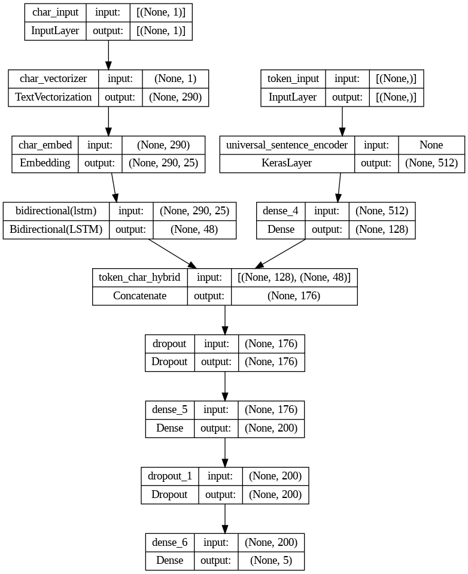
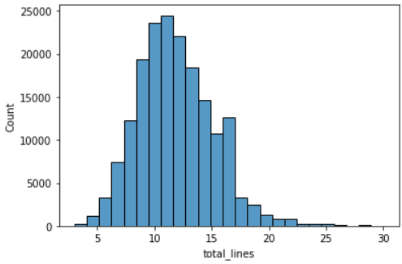
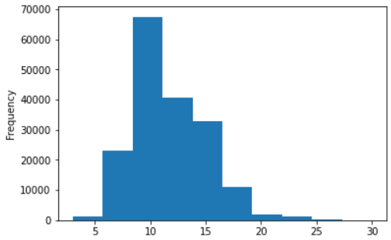
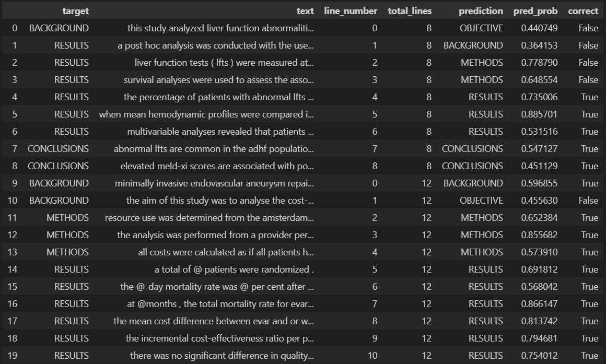

# SkimLit

This project makes skimming articles on PubMed site easier and faster. It aims to extract PubMed abstracts's different parts as described below.

1. Objectives
2. Methods
3. Results
4. Conclusion
5. Background

The baseline model is developed using a TFIDF vectorizer and multinomial naive bayse model using pipelines.
The other experiments are as followed:

1. **Conv1D model**

2. **Data pipeline for deep models**

3. **Pretrained feature extraction with pretrained token embeddings using universal sentence encoder (USE) from tensorflow hub.**

4. **Conv1D model with character embeddings and character level tokenizer**

[]
5. **Combining pretrained token embeddings + character embeddings (hybrid embedding layer)**
6. **Transfer Learning with pretrained token embeddings + character embeddings + positional embeddings (tribrid embedding model)**

I have compared these different models and looked at the most wrong predictions and example predictions.**
Furthermore, I have experimented with pretrained GloVe embeddings and TensorFlow Hub BERT PubMed expert (a language model pretrained on PubMed texts) pretrained embedding.

## Data

[PubMed 200k RCT](https://github.com/Franck-Dernoncourt/pubmed-rct.git) is a new dataset based on PubMed for sequential sentence classification. The dataset consists of approximately 200,000 abstracts of randomized controlled trials, totaling 2.3 million sentences. Each sentence of each abstract is labeled with their role in the abstract using one of the following classes: background, objective, method, result, or conclusion.

Here, you see the training dataframe:

[]

This is an article abstract in which the numbers are replaced with @ mark.

> To investigate the efficacy of @ weeks of daily low-dose oral prednisolone in improving pain , mobility , and systemic low-grade inflammation in the short term and whether the effect would be sustained at @ weeks in older adults with moderate to severe knee osteoarthritis ( OA ). A total of @ patients with primary knee OA were randomized @:@ ; @ received @ mg/day of prednisolone and @ received placebo for @ weeks. Outcome measures included pain reduction and improvement in function scores and systemic inflammation markers. Pain was assessed using the visual analog pain scale ( @-@ mm ). Secondary outcome measures included the Western Ontario and McMaster Universities Osteoarthritis Index scores , patient global assessment ( PGA ) of the severity of knee OA , and @-min walk distance ( @MWD )., Serum levels of interleukin @ ( IL-@ ) , IL-@ , tumor necrosis factor ( TNF ) - , and high-sensitivity C-reactive protein ( hsCRP ) were measured. There was a clinically relevant reduction in the intervention group compared to the placebo group for knee pain , physical function , PGA , and @MWD at @ weeks. The mean difference between treatment arms ( @ % CI ) was @ ( @-@ @ ) , p < @ ; @ ( @-@ @ ) , p < @ ; @ ( @-@ @ ) , p < @ ; and @ ( @-@ @ ) , p < @ , respectively. Further , there was a clinically relevant reduction in the serum levels of IL-@ , IL-@ , TNF - , and hsCRP at @ weeks in the intervention group when compared to the placebo group. These differences remained significant at @ weeks. The Outcome Measures in Rheumatology Clinical Trials-Osteoarthritis Research Society International responder rate was @ % in the intervention group and @ % in the placebo group ( p < @ ). Low-dose oral prednisolone had both a short-term and a longer sustained effect resulting in less knee pain , better physical function , and attenuation of systemic inflammation in older patients with knee OA ( ClinicalTrials.gov identifier NCT@ ).

Also, I have used a sample abstract to test the model as well. This data will be automatically downloaded while the notebook is running.

## Features

Further feature engineering has been done to produce line numbers and total lines in an abstract.


Most article abstracts are between 10-15 lines long.



95 percent of sentences are below 55 words in length.


95 percent of words have a length less than 290 characters.


A value of 20 lines in an article abstract covers 98 percent of data.



## Installation

You can install the required libraries by the command below:

```bash
pip install -r requirements.txt
```

## Run

You can run the notebook on Colab, Kaggle or jupyter notebook.

Clone the project

```bash
  git clone https://github.com/BlakeAmory/SkimLit
```

## Results

You can see the model output below:

> ['###24293578\n',
 'OBJECTIVE\tTo investigate the efficacy of @ weeks of daily low-dose oral prednisolone in improving pain , mobility , and systemic low-grade inflammation in the short term and whether the effect would be sustained at @ weeks in older adults with moderate to severe knee osteoarthritis ( OA ) .\n',
 'METHODS\tA total of @ patients with primary knee OA were randomized @:@ ; @ received @ mg/day of prednisolone and @ received placebo for @ weeks .\n',
 'METHODS\tOutcome measures included pain reduction and improvement in function scores and systemic inflammation markers .\n',
 'METHODS\tPain was assessed using the visual analog pain scale ( @-@ mm ) .\n',
 'METHODS\tSecondary outcome measures included the Western Ontario and McMaster Universities Osteoarthritis Index scores , patient global assessment ( PGA ) of the severity of knee OA , and @-min walk distance ( @MWD ) .\n',
 'METHODS\tSerum levels of interleukin @ ( IL-@ ) , IL-@ , tumor necrosis factor ( TNF ) - , and high-sensitivity C-reactive protein ( hsCRP ) were measured .\n',
 'RESULTS\tThere was a clinically relevant reduction in the intervention group compared to the placebo group for knee pain , physical function , PGA , and @MWD at @ weeks .\n',
 'RESULTS\tThe mean difference between treatment arms ( @ % CI ) was @ ( @-@ @ ) , p < @ ; @ ( @-@ @ ) , p < @ ; @ ( @-@ @ ) , p < @ ; and @ ( @-@ @ ) , p < @ , respectively .\n',
 'RESULTS\tFurther , there was a clinically relevant reduction in the serum levels of IL-@ , IL-@ , TNF - , and hsCRP at @ weeks in the intervention group when compared to the placebo group .\n',
 'RESULTS\tThese differences remained significant at @ weeks .\n',
 'RESULTS\tThe Outcome Measures in Rheumatology Clinical Trials-Osteoarthritis Research Society International responder rate was @ % in the intervention group and @ % in the placebo group ( p < @ ) .\n',
 'CONCLUSIONS\tLow-dose oral prednisolone had both a short-term and a longer sustained effect resulting in less knee pain , better physical function , and attenuation of systemic inflammation in older patients with knee OA ( ClinicalTrials.gov identifier NCT@ ) .\n',
 '\n',
 '###24854809\n',
 'BACKGROUND\tEmotional eating is associated with overeating and the development of obesity .\n',
 'BACKGROUND\tYet , empirical evidence for individual ( trait ) differences in emotional eating and cognitive mechanisms that contribute to eating during sad mood remain equivocal .\n',
 'OBJECTIVE\tThe aim of this study was to test if attention bias for food moderates the effect of self-reported emotional eating during sad mood ( vs neutral mood ) on actual food intake .\n',
 'OBJECTIVE\tIt was expected that emotional eating is predictive of elevated attention for food and higher food intake after an experimentally induced sad mood and that attentional maintenance on food predicts food intake during a sad versus a neutral mood .\n',
 'METHODS\tParticipants ( N = @ ) were randomly assigned to one of the two experimental mood induction conditions ( sad/neutral ) .\n']

The classification performance (f1-score) on different classes has been measured and shown in a confusion matrix.


The tribrid_embedding model has reached 0.8546 performance with regards to f1-score and the loss curves are plotted to visualize the evaluation step. Here you see an example plot of model 1 (Conv1D model) training loss curves:


Furthermore, the model's 100 top wrong predictions have been observed. An example is shown below.

> - Target: CONCLUSIONS, Pred: METHODS, Prob: 0.9488437175750732, Line number: 4, Total lines: 6
> - Text: symptom outcomes will be assessed and estimates of cost-effectiveness made .



Finally, the model has been tested on example [data on PubMed](https://pubmed.ncbi.nlm.nih.gov/20232240/) site. You can see the output here:

> - OBJECTIVE: This RCT examined the efficacy of a manualized social intervention for children with HFASDs.
> - METHODS: Participants were randomly assigned to treatment or wait-list conditions.
> - METHODS: Treatment included instruction and therapeutic activities targeting social skills, face-emotion recognition, interest expansion, and interpretation of non-literal language.
> - METHODS: A response-cost program was applied to reduce problem behaviors and foster skills acquisition.
> - METHODS: Significant treatment effects were found for five of seven primary outcome measures (parent ratings and direct child measures).
> - METHODS: Secondary measures based on staff ratings (treatment group only) corroborated gains reported by parents.
> - RESULTS: High levels of parent, child and staff satisfaction were reported, along with high levels of treatment fidelity.
> - RESULTS: Standardized effect size estimates were primarily in the medium and large ranges and favored the treatment group.

You can compare models based on the plots below:

[]

This plot shows sorted model performance based on f1-score:

[]

Based on these comparisons model 5 (tribrid embeddings) is the best model.

The tribrid embedding model with bert preprocessing and merging positional embeddings (line number and total lines) has reached 0.8906 accuracy. The model architecture is shown below:


The output of this model has been added below:

> - OBJECTIVE:  This RCT examined the efficacy of a manualized social intervention for children with HFASDs.
> - METHODS:  Participants were randomly assigned to treatment or wait-list conditions.
> - METHODS:  Treatment included instruction and therapeutic activities targeting social skills, face-emotion recognition, interest expansion, and interpretation of non-literal language.
> - METHODS:  A response-cost program was applied to reduce problem behaviors and foster skills acquisition.
> - RESULTS:  Significant treatment effects were found for five of seven primary outcome measures (parent ratings and direct child measures).
> - METHODS:  Secondary measures based on staff ratings (treatment group only) corroborated gains reported by parents.
> - RESULTS:  High levels of parent, child and staff satisfaction were reported, along with high levels of treatment fidelity.
> - RESULTS:  Standardized effect size estimates were primarily in the medium and large ranges and favored the treatment group.

## Lessons Learned

- Tribrid embeddings including character embeddings, token embeddings and positional embeddings have shown high performance in skimming literature.

- Pretrained embeddings like bert for preprocessing text data along with tribrid embeddings can achieve high performance on PubMed abstracts.

## Papers

This project is done based on 2 articles:

1. [**PubMed 200k RCT: a Dataset for Sequential Sentence Classification in Medical Abstracts**](https://arxiv.org/abs/1710.06071) article from Franck Dernoncourt et al.

2. [**Neural Networks for Joint Sentence Classification in Medical Paper Abstracts**](https://arxiv.org/abs/1612.05251) article from Franck Dernoncourt et al.

## License

This project is under MIT license:

[](https://choosealicense.com/licenses/mit/)
